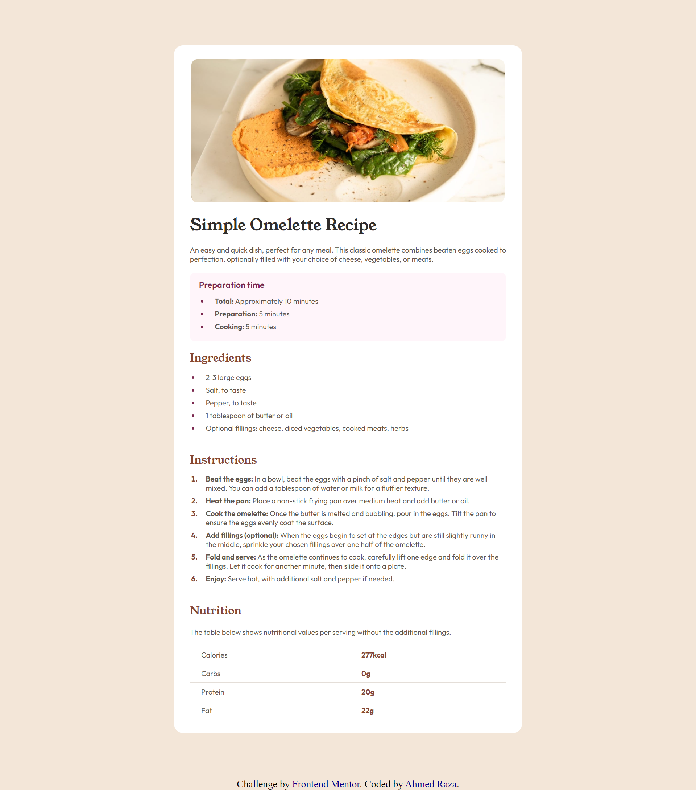

# Frontend Mentor - Recipe page solution

This is a solution to the [Recipe page challenge on Frontend Mentor](https://www.frontendmentor.io/challenges/recipe-page-KiTsR8QQKm). Frontend Mentor challenges help you improve your coding skills by building realistic projects. 

## Table of contents

- [Overview](#overview)
  - [The challenge](#the-challenge)
  - [Screenshot](#screenshot)
  - [Links](#links)
- [My process](#my-process)
  - [Built with](#built-with)
  - [What I learned](#what-i-learned)
  - [Useful resources](#useful-resources)
- [Author](#author)

**Note: Delete this note and update the table of contents based on what sections you keep.**

## Overview

### Screenshot

### Links

- Solution URL: [Add solution URL here]
- Live Site URL: [Add live site URL here]

## My process

### Built with

- Semantic HTML5 markup
- CSS custom properties
- Flexbox
- CSS Grid
- Mobile-first workflow
- Media Queries

### What I learned

In this project, I learned how to work with media queries and also became aware of some of the issues with them. I also learned few CSS properties of Tables. I had not used tables in any of my projects till now, so definitely it was a good learning experience.

### Useful resources

- [W3Schools](https://www.w3schools.com) - For HTML Tables and it's CSS properties.

## Author

- Frontend Mentor - [@ahmedraza032](https://www.frontendmentor.io/profile/ahmedraza032)

